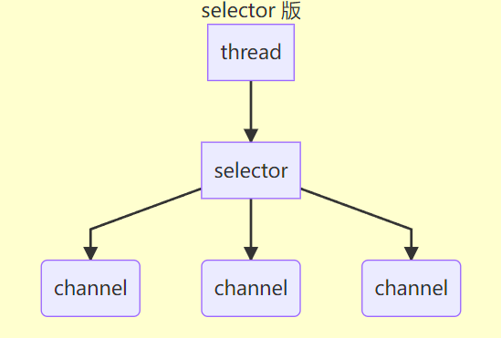
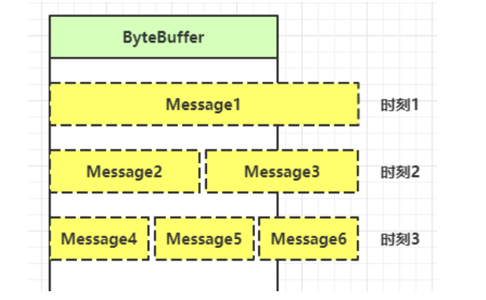

## 网络编程

### 非阻塞和阻塞

#### 阻塞

* 阻塞模式下，相关方法都会导致线程暂停
  * ServerSocketChannel.accept 会在没有连接建立时让线程暂停
  * SocketChannel.read 会在没有数据可读时让线程暂停
  * 阻塞的表现其实就是线程暂停了，暂停期间不会占用 cpu，但线程相当于闲置
* 单线程下，阻塞方法之间相互影响，几乎不能正常工作，需要多线程支持
* 但多线程下，有新的问题，体现在以下方面
  * 32 位 jvm 一个线程 320k，64 位 jvm 一个线程 1024k，如果连接数过多，必然导致 OOM，并且线程太多，反而会因为频繁上下文切换导致性能降低
  * 可以采用线程池技术来减少线程数和线程上下文切换，但治标不治本，如果有很多连接建立，但长时间 inactive，会阻塞线程池中所有线程，因此不适合长连接，只适合短连接


服务器端

```java
package mao.t1;

import mao.utils.ByteBufferUtil;
import org.slf4j.Logger;
import org.slf4j.LoggerFactory;

import java.io.IOException;
import java.net.InetSocketAddress;
import java.nio.ByteBuffer;
import java.nio.channels.ServerSocketChannel;
import java.nio.channels.SocketChannel;
import java.util.ArrayList;
import java.util.List;

/**
 * Project name(项目名称)：Netty_Net_Programming
 * Package(包名): mao.t1
 * Class(类名): Server
 * Author(作者）: mao
 * Author QQ：1296193245
 * GitHub：https://github.com/maomao124/
 * Date(创建日期)： 2023/3/13
 * Time(创建时间)： 19:28
 * Version(版本): 1.0
 * Description(描述)： 阻塞模式 - 服务器端
 */

public class Server
{

    /**
     * 日志
     */
    private static final Logger log = LoggerFactory.getLogger(Server.class);

    /**
     * main方法
     *
     * @param args 参数
     */
    public static void main(String[] args) throws IOException
    {
        ByteBuffer byteBuffer = ByteBuffer.allocate(16);
        //创建服务器
        ServerSocketChannel serverSocketChannel = ServerSocketChannel.open();
        //绑定
        serverSocketChannel.bind(new InetSocketAddress(8080));
        //连接集合
        List<SocketChannel> socketChannelList = new ArrayList<>();

        while (true)
        {
            log.debug("等待客户端连接...");
            SocketChannel socketChannel = serverSocketChannel.accept();
            log.debug("客户端已连接：" + socketChannel);
            //放入连接集合
            socketChannelList.add(socketChannel);

            //遍历连接集合
            for (SocketChannel channel : socketChannelList)
            {
                log.debug("等待读：" + channel);
                int read = channel.read(byteBuffer);
                byteBuffer.flip();
                ByteBufferUtil.debugAll(byteBuffer);
                byteBuffer.clear();
                log.debug("读取成功：" + channel);
            }
        }
    }
}
```


客户端

```java
package mao.t1;

import org.slf4j.Logger;
import org.slf4j.LoggerFactory;

import java.io.IOException;
import java.net.InetSocketAddress;
import java.nio.ByteBuffer;
import java.nio.channels.SocketChannel;
import java.nio.charset.StandardCharsets;
import java.util.Scanner;

/**
 * Project name(项目名称)：Netty_Net_Programming
 * Package(包名): mao.t1
 * Class(类名): Client
 * Author(作者）: mao
 * Author QQ：1296193245
 * GitHub：https://github.com/maomao124/
 * Date(创建日期)： 2023/3/13
 * Time(创建时间)： 19:29
 * Version(版本): 1.0
 * Description(描述)： 阻塞模式 - 客户端
 */

public class Client
{
    /**
     * 日志
     */
    private static final Logger log = LoggerFactory.getLogger(Client.class);

    /**
     * main方法
     *
     * @param args 参数
     */
    public static void main(String[] args) throws IOException
    {
        SocketChannel socketChannel = SocketChannel.open();
        socketChannel.connect(new InetSocketAddress("127.0.0.1", 8080));
        Scanner input = new Scanner(System.in);
        input.nextLine();
        socketChannel.write(ByteBuffer.wrap("hello".getBytes(StandardCharsets.UTF_8)));
        input.nextLine();
        socketChannel.close();
    }
}
```


运行结果：

```sh
2023-03-13  19:55:29.913  [main] DEBUG mao.t1.Server:  等待客户端连接...
2023-03-13  19:55:34.369  [main] DEBUG mao.t1.Server:  客户端已连接：java.nio.channels.SocketChannel[connected local=/127.0.0.1:8080 remote=/127.0.0.1:52287]
2023-03-13  19:55:34.369  [main] DEBUG mao.t1.Server:  等待读：java.nio.channels.SocketChannel[connected local=/127.0.0.1:8080 remote=/127.0.0.1:52287]
2023-03-13  19:55:47.916  [main] DEBUG io.netty.util.internal.logging.InternalLoggerFactory:  Using SLF4J as the default logging framework
+--------+-------------------- all ------------------------+----------------+
position: [0], limit: [5]
         +-------------------------------------------------+
         |  0  1  2  3  4  5  6  7  8  9  a  b  c  d  e  f |
+--------+-------------------------------------------------+----------------+
|00000000| 68 65 6c 6c 6f 00 00 00 00 00 00 00 00 00 00 00 |hello...........|
+--------+-------------------------------------------------+----------------+
2023-03-13  19:55:47.924  [main] DEBUG mao.t1.Server:  读取成功：java.nio.channels.SocketChannel[connected local=/127.0.0.1:8080 remote=/127.0.0.1:52287]
2023-03-13  19:55:47.924  [main] DEBUG mao.t1.Server:  等待客户端连接...
```


如果在等待客户端读的过程中有另一个客户端建立连接，那么必须要等到第一个客户端发送数据后才能建立连接


```sh
2023-03-13  19:56:50.020  [main] DEBUG mao.t1.Server:  等待客户端连接...
2023-03-13  19:56:55.019  [main] DEBUG mao.t1.Server:  客户端已连接：java.nio.channels.SocketChannel[connected local=/127.0.0.1:8080 remote=/127.0.0.1:52309]
2023-03-13  19:56:55.019  [main] DEBUG mao.t1.Server:  等待读：java.nio.channels.SocketChannel[connected local=/127.0.0.1:8080 remote=/127.0.0.1:52309]
2023-03-13  19:57:14.891  [main] DEBUG io.netty.util.internal.logging.InternalLoggerFactory:  Using SLF4J as the default logging framework
+--------+-------------------- all ------------------------+----------------+
position: [0], limit: [5]
         +-------------------------------------------------+
         |  0  1  2  3  4  5  6  7  8  9  a  b  c  d  e  f |
+--------+-------------------------------------------------+----------------+
|00000000| 68 65 6c 6c 6f 00 00 00 00 00 00 00 00 00 00 00 |hello...........|
+--------+-------------------------------------------------+----------------+
2023-03-13  19:57:14.895  [main] DEBUG mao.t1.Server:  读取成功：java.nio.channels.SocketChannel[connected local=/127.0.0.1:8080 remote=/127.0.0.1:52309]
2023-03-13  19:57:14.895  [main] DEBUG mao.t1.Server:  等待客户端连接...
2023-03-13  19:57:14.895  [main] DEBUG mao.t1.Server:  客户端已连接：java.nio.channels.SocketChannel[connected local=/127.0.0.1:8080 remote=/127.0.0.1:52314]
2023-03-13  19:57:14.895  [main] DEBUG mao.t1.Server:  等待读：java.nio.channels.SocketChannel[connected local=/127.0.0.1:8080 remote=/127.0.0.1:52309]
```


#### 非阻塞

* 非阻塞模式下，相关方法都会不会让线程暂停
  * 在 ServerSocketChannel.accept 在没有连接建立时，会返回 null，继续运行
  * SocketChannel.read 在没有数据可读时，会返回 0，但线程不必阻塞，可以去执行其它 SocketChannel 的 read 或是去执行 ServerSocketChannel.accept 
  * 写数据时，线程只是等待数据写入 Channel 即可，无需等 Channel 通过网络把数据发送出去
* 但非阻塞模式下，即使没有连接建立，和可读数据，线程仍然在不断运行，白白浪费了 cpu
* 数据复制过程中，线程实际还是阻塞的（AIO 改进的地方）


服务器端

```java
package mao.t2;

import mao.utils.ByteBufferUtil;
import org.slf4j.Logger;
import org.slf4j.LoggerFactory;

import java.io.IOException;
import java.net.InetSocketAddress;
import java.nio.ByteBuffer;
import java.nio.channels.ServerSocketChannel;
import java.nio.channels.SocketChannel;
import java.util.ArrayList;
import java.util.List;

/**
 * Project name(项目名称)：Netty_Net_Programming
 * Package(包名): mao.t2
 * Class(类名): Server
 * Author(作者）: mao
 * Author QQ：1296193245
 * GitHub：https://github.com/maomao124/
 * Date(创建日期)： 2023/3/13
 * Time(创建时间)： 20:08
 * Version(版本): 1.0
 * Description(描述)： 非阻塞模式 - 服务器端
 */

public class Server
{
    /**
     * 日志
     */
    private static final Logger log = LoggerFactory.getLogger(mao.t1.Server.class);

    /**
     * main方法
     *
     * @param args 参数
     */
    public static void main(String[] args) throws IOException, InterruptedException
    {
        ByteBuffer byteBuffer = ByteBuffer.allocate(16);
        //创建服务器
        ServerSocketChannel serverSocketChannel = ServerSocketChannel.open();
        //设置成非阻塞模式
        serverSocketChannel.configureBlocking(false);
        //绑定
        serverSocketChannel.bind(new InetSocketAddress(8080));
        //连接集合
        List<SocketChannel> socketChannelList = new ArrayList<>();


        while (true)
        {
            //log.debug("等待客户端连接...");
            SocketChannel socketChannel = serverSocketChannel.accept();
            if (socketChannel != null)
            {
                log.debug("客户端已连接：" + socketChannel);
                //设置成非阻塞模式
                socketChannel.configureBlocking(false);
                //放入连接集合
                socketChannelList.add(socketChannel);
            }

            //遍历连接集合
            for (SocketChannel channel : socketChannelList)
            {
                int read = channel.read(byteBuffer);
                if (read > 0)
                {
                    log.debug("等待读：" + channel);
                    byteBuffer.flip();
                    ByteBufferUtil.debugAll(byteBuffer);
                    byteBuffer.clear();
                    log.debug("读取成功：" + channel);
                }
            }
        }
    }
}
```


运行结果：

```sh
2023-03-13  20:21:36.165  [main] DEBUG mao.t1.Server:  客户端已连接：java.nio.channels.SocketChannel[connected local=/127.0.0.1:8080 remote=/127.0.0.1:52663]
2023-03-13  20:22:00.145  [main] DEBUG mao.t1.Server:  客户端已连接：java.nio.channels.SocketChannel[connected local=/127.0.0.1:8080 remote=/127.0.0.1:52674]
2023-03-13  20:22:15.488  [main] DEBUG mao.t1.Server:  等待读：java.nio.channels.SocketChannel[connected local=/127.0.0.1:8080 remote=/127.0.0.1:52663]
2023-03-13  20:22:15.490  [main] DEBUG io.netty.util.internal.logging.InternalLoggerFactory:  Using SLF4J as the default logging framework
+--------+-------------------- all ------------------------+----------------+
position: [0], limit: [5]
         +-------------------------------------------------+
         |  0  1  2  3  4  5  6  7  8  9  a  b  c  d  e  f |
+--------+-------------------------------------------------+----------------+
|00000000| 68 65 6c 6c 6f 00 00 00 00 00 00 00 00 00 00 00 |hello...........|
+--------+-------------------------------------------------+----------------+
2023-03-13  20:22:15.494  [main] DEBUG mao.t1.Server:  读取成功：java.nio.channels.SocketChannel[connected local=/127.0.0.1:8080 remote=/127.0.0.1:52663]
2023-03-13  20:22:28.888  [main] DEBUG mao.t1.Server:  客户端已连接：java.nio.channels.SocketChannel[connected local=/127.0.0.1:8080 remote=/127.0.0.1:52683]
2023-03-13  20:22:35.359  [main] DEBUG mao.t1.Server:  等待读：java.nio.channels.SocketChannel[connected local=/127.0.0.1:8080 remote=/127.0.0.1:52683]
+--------+-------------------- all ------------------------+----------------+
position: [0], limit: [5]
         +-------------------------------------------------+
         |  0  1  2  3  4  5  6  7  8  9  a  b  c  d  e  f |
+--------+-------------------------------------------------+----------------+
|00000000| 68 65 6c 6c 6f 00 00 00 00 00 00 00 00 00 00 00 |hello...........|
+--------+-------------------------------------------------+----------------+
2023-03-13  20:22:35.359  [main] DEBUG mao.t1.Server:  读取成功：java.nio.channels.SocketChannel[connected local=/127.0.0.1:8080 remote=/127.0.0.1:52683]
2023-03-13  20:22:47.549  [main] DEBUG mao.t1.Server:  等待读：java.nio.channels.SocketChannel[connected local=/127.0.0.1:8080 remote=/127.0.0.1:52674]
+--------+-------------------- all ------------------------+----------------+
position: [0], limit: [5]
         +-------------------------------------------------+
         |  0  1  2  3  4  5  6  7  8  9  a  b  c  d  e  f |
+--------+-------------------------------------------------+----------------+
|00000000| 68 65 6c 6c 6f 00 00 00 00 00 00 00 00 00 00 00 |hello...........|
+--------+-------------------------------------------------+----------------+
2023-03-13  20:22:47.549  [main] DEBUG mao.t1.Server:  读取成功：java.nio.channels.SocketChannel[connected local=/127.0.0.1:8080 remote=/127.0.0.1:52674]
```


#### 多路复用

单线程可以配合 Selector 完成对多个 Channel 可读写事件的监控，这称之为多路复用

* 多路复用仅针对网络 IO、普通文件 IO 没法利用多路复用
* 如果不用 Selector 的非阻塞模式，线程大部分时间都在做无用功，而 Selector 能够保证
  * 有可连接事件时才去连接
  * 有可读事件才去读取
  * 有可写事件才去写入
    * 限于网络传输能力，Channel 未必时时可写，一旦 Channel 可写，会触发 Selector 的可写事件


### Selector




好处

* 一个线程配合 selector 就可以监控多个 channel 的事件，事件发生线程才去处理。避免非阻塞模式下所做无用功
* 让这个线程能够被充分利用
* 节约了线程的数量
* 减少了线程上下文切换


#### 创建

```java
Selector selector = Selector.open();
```


#### 绑定 Channel 事件

也称之为注册事件

```java
channel.configureBlocking(false);
SelectionKey key = channel.register(selector, 绑定事件);
```


* channel 必须工作在非阻塞模式
* FileChannel 没有非阻塞模式，因此不能配合 selector 一起使用
* 绑定的事件类型可以有
  * connect - 客户端连接成功时触发
  * accept - 服务器端成功接受连接时触发
  * read - 数据可读入时触发，有因为接收能力弱，数据暂不能读入的情况
  * write - 数据可写出时触发，有因为发送能力弱，数据暂不能写出的情况


#### 监听 Channel 事件

可以通过下面三种方法来监听是否有事件发生，方法的返回值代表有多少 channel 发生了事件


方法1，阻塞直到绑定事件发生

```java
int count = selector.select();
```


方法2，阻塞直到绑定事件发生，或是超时（时间单位为 ms）

```java
int count = selector.select(long timeout);
```


方法3，不会阻塞，也就是不管有没有事件，立刻返回，自己根据返回值检查是否有事件

```sh
int count = selector.selectNow();
```


**select 何时不阻塞?**

* 事件发生时
  * 客户端发起连接请求，会触发 accept 事件
  * 客户端发送数据过来，客户端正常、异常关闭时，都会触发 read 事件，另外如果发送的数据大于 buffer 缓冲区，会触发多次读取事件
  * channel 可写，会触发 write 事件
  * 在 linux 下 nio bug 发生时
* 调用 selector.wakeup()
* 调用 selector.close()
* selector 所在线程 interrupt


#### 处理 accept 事件


```java
package mao.t3;

import mao.utils.ByteBufferUtil;
import org.slf4j.Logger;
import org.slf4j.LoggerFactory;

import java.io.IOException;
import java.net.InetSocketAddress;
import java.nio.ByteBuffer;
import java.nio.channels.*;
import java.util.ArrayList;
import java.util.Iterator;
import java.util.List;
import java.util.Set;

/**
 * Project name(项目名称)：Netty_Net_Programming
 * Package(包名): mao.t3
 * Class(类名): Server
 * Author(作者）: mao
 * Author QQ：1296193245
 * GitHub：https://github.com/maomao124/
 * Date(创建日期)： 2023/3/13
 * Time(创建时间)： 20:50
 * Version(版本): 1.0
 * Description(描述)： select - 服务端
 */

public class Server
{
    /**
     * 日志
     */
    private static final Logger log = LoggerFactory.getLogger(mao.t3.Server.class);

    /**
     * main方法
     *
     * @param args 参数
     */
    public static void main(String[] args) throws IOException, InterruptedException
    {
        ByteBuffer byteBuffer = ByteBuffer.allocate(16);
        //创建服务器
        ServerSocketChannel serverSocketChannel = ServerSocketChannel.open();
        //设置成非阻塞模式
        serverSocketChannel.configureBlocking(false);
        //绑定
        serverSocketChannel.bind(new InetSocketAddress(8080));

        //Selector
        Selector selector = Selector.open();
        //注册，事件为OP_WRITE
        serverSocketChannel.register(selector, SelectionKey.OP_ACCEPT);

        Runtime.getRuntime().addShutdownHook(new Thread(new Runnable()
        {
            @Override
            public void run()
            {
                try
                {
                    serverSocketChannel.close();
                }
                catch (IOException e)
                {
                    e.printStackTrace();
                }
                try
                {
                    selector.close();
                }
                catch (IOException e)
                {
                    e.printStackTrace();
                }

            }
        }));

        while (true)
        {
            int count = selector.select();
            log.debug("事件总数：" + count);

            //获取所有事件
            Set<SelectionKey> selectionKeys = selector.selectedKeys();

            Iterator<SelectionKey> iterator = selectionKeys.iterator();
            while (iterator.hasNext())
            {
                //获得SelectionKey
                SelectionKey selectionKey = iterator.next();
                //判断事件类型

                //连接服务器
                if (selectionKey.isAcceptable())
                {
                    ServerSocketChannel ssc = (ServerSocketChannel) selectionKey.channel();
                    //处理连接事件
                    SocketChannel socketChannel = ssc.accept();
                    log.debug("连接事件：" + socketChannel);
                }

                // 处理完毕，必须将事件移除
                iterator.remove();
            }
        }
    }
}
```


运行结果：

```sh
2023-03-13  21:21:39.835  [main] DEBUG mao.t3.Server:  事件总数：1
2023-03-13  21:21:39.837  [main] DEBUG mao.t3.Server:  连接事件：java.nio.channels.SocketChannel[connected local=/127.0.0.1:8080 remote=/127.0.0.1:62918]
2023-03-13  21:21:41.854  [main] DEBUG mao.t3.Server:  事件总数：1
2023-03-13  21:21:41.854  [main] DEBUG mao.t3.Server:  连接事件：java.nio.channels.SocketChannel[connected local=/127.0.0.1:8080 remote=/127.0.0.1:62922]
2023-03-13  21:21:47.043  [main] DEBUG mao.t3.Server:  事件总数：1
2023-03-13  21:21:47.044  [main] DEBUG mao.t3.Server:  连接事件：java.nio.channels.SocketChannel[connected local=/127.0.0.1:8080 remote=/127.0.0.1:62927]
```


#### 处理 read 事件

```java
package mao.t3;

import mao.utils.ByteBufferUtil;
import org.slf4j.Logger;
import org.slf4j.LoggerFactory;

import java.io.IOException;
import java.net.InetSocketAddress;
import java.nio.ByteBuffer;
import java.nio.channels.*;
import java.util.ArrayList;
import java.util.Iterator;
import java.util.List;
import java.util.Set;

/**
 * Project name(项目名称)：Netty_Net_Programming
 * Package(包名): mao.t3
 * Class(类名): Server
 * Author(作者）: mao
 * Author QQ：1296193245
 * GitHub：https://github.com/maomao124/
 * Date(创建日期)： 2023/3/13
 * Time(创建时间)： 20:50
 * Version(版本): 1.0
 * Description(描述)： select - 服务端
 */

public class Server
{
    /**
     * 日志
     */
    private static final Logger log = LoggerFactory.getLogger(mao.t3.Server.class);

    /**
     * main方法
     *
     * @param args 参数
     */
    public static void main(String[] args) throws IOException, InterruptedException
    {
        ByteBuffer byteBuffer = ByteBuffer.allocate(16);
        //创建服务器
        ServerSocketChannel serverSocketChannel = ServerSocketChannel.open();
        //设置成非阻塞模式
        serverSocketChannel.configureBlocking(false);
        //绑定
        serverSocketChannel.bind(new InetSocketAddress(8080));

        //Selector
        Selector selector = Selector.open();
        //注册，事件为OP_WRITE
        serverSocketChannel.register(selector, SelectionKey.OP_ACCEPT);

        Runtime.getRuntime().addShutdownHook(new Thread(new Runnable()
        {
            @Override
            public void run()
            {
                try
                {
                    serverSocketChannel.close();
                }
                catch (IOException e)
                {
                    e.printStackTrace();
                }
                try
                {
                    selector.close();
                }
                catch (IOException e)
                {
                    e.printStackTrace();
                }

            }
        }));

        while (true)
        {
            int count = selector.select();
            log.debug("事件总数：" + count);

            //获取所有事件
            Set<SelectionKey> selectionKeys = selector.selectedKeys();

            Iterator<SelectionKey> iterator = selectionKeys.iterator();
            while (iterator.hasNext())
            {
                //获得SelectionKey
                SelectionKey selectionKey = iterator.next();
                //判断事件类型

                //连接服务器
                if (selectionKey.isAcceptable())
                {
                    ServerSocketChannel ssc = (ServerSocketChannel) selectionKey.channel();
                    //处理连接事件
                    SocketChannel socketChannel = ssc.accept();
                    log.debug("连接事件：" + socketChannel);
                    //非阻塞
                    socketChannel.configureBlocking(false);
                    //注册，事件为OP_WRITE
                    socketChannel.register(selector, SelectionKey.OP_READ);
                    log.debug("连接已注册到selector");
                }

                //读事件
                else if (selectionKey.isReadable())
                {
                    SocketChannel socketChannel = (SocketChannel) selectionKey.channel();
                    //处理读事件
                    log.debug("读事件：" + socketChannel);
                    int read = socketChannel.read(byteBuffer);
                    if (read == -1)
                    {
                        selectionKey.cancel();
                        socketChannel.close();
                    }
                    else
                    {
                        byteBuffer.flip();
                        ByteBufferUtil.debugAll(byteBuffer);
                        byteBuffer.clear();
                    }

                }

                // 处理完毕，必须将事件移除
                iterator.remove();
            }
        }
    }
}
```


运行结果：

```sh
2023-03-13  21:40:39.869  [main] DEBUG mao.t3.Server:  事件总数：1
2023-03-13  21:40:39.871  [main] DEBUG mao.t3.Server:  连接事件：java.nio.channels.SocketChannel[connected local=/127.0.0.1:8080 remote=/127.0.0.1:63466]
2023-03-13  21:40:39.871  [main] DEBUG mao.t3.Server:  连接已注册到selector
2023-03-13  21:40:56.924  [main] DEBUG mao.t3.Server:  事件总数：1
2023-03-13  21:40:56.925  [main] DEBUG mao.t3.Server:  读事件：java.nio.channels.SocketChannel[connected local=/127.0.0.1:8080 remote=/127.0.0.1:63466]
2023-03-13  21:40:56.929  [main] DEBUG io.netty.util.internal.logging.InternalLoggerFactory:  Using SLF4J as the default logging framework
+--------+-------------------- all ------------------------+----------------+
position: [0], limit: [5]
         +-------------------------------------------------+
         |  0  1  2  3  4  5  6  7  8  9  a  b  c  d  e  f |
+--------+-------------------------------------------------+----------------+
|00000000| 68 65 6c 6c 6f 00 00 00 00 00 00 00 00 00 00 00 |hello...........|
+--------+-------------------------------------------------+----------------+
2023-03-13  21:41:11.388  [main] DEBUG mao.t3.Server:  事件总数：1
2023-03-13  21:41:11.388  [main] DEBUG mao.t3.Server:  读事件：java.nio.channels.SocketChannel[connected local=/127.0.0.1:8080 remote=/127.0.0.1:63466]
2023-03-13  21:41:23.993  [main] DEBUG mao.t3.Server:  事件总数：1
2023-03-13  21:41:23.994  [main] DEBUG mao.t3.Server:  连接事件：java.nio.channels.SocketChannel[connected local=/127.0.0.1:8080 remote=/127.0.0.1:63475]
2023-03-13  21:41:23.994  [main] DEBUG mao.t3.Server:  连接已注册到selector
2023-03-13  21:41:36.106  [main] DEBUG mao.t3.Server:  事件总数：1
2023-03-13  21:41:36.106  [main] DEBUG mao.t3.Server:  读事件：java.nio.channels.SocketChannel[connected local=/127.0.0.1:8080 remote=/127.0.0.1:63475]
+--------+-------------------- all ------------------------+----------------+
position: [0], limit: [5]
         +-------------------------------------------------+
         |  0  1  2  3  4  5  6  7  8  9  a  b  c  d  e  f |
+--------+-------------------------------------------------+----------------+
|00000000| 68 65 6c 6c 6f 00 00 00 00 00 00 00 00 00 00 00 |hello...........|
+--------+-------------------------------------------------+----------------+
2023-03-13  21:41:46.074  [main] DEBUG mao.t3.Server:  事件总数：1
2023-03-13  21:41:46.074  [main] DEBUG mao.t3.Server:  读事件：java.nio.channels.SocketChannel[connected local=/127.0.0.1:8080 remote=/127.0.0.1:63475]
```


**为何要 iter.remove()?**

因为 select 在事件发生后，就会将相关的 key 放入 selectedKeys 集合，但不会在处理完后从 selectedKeys 集合中移除，需要我们自己编码删除。例如

* 第一次触发了 ssckey 上的 accept 事件，没有移除 ssckey 
* 第二次触发了 sckey 上的 read 事件，但这时 selectedKeys 中还有上次的 ssckey ，在处理时因为没有真正的 serverSocket 连上了，就会导致空指针异常


**cancel 的作用**

cancel 会取消注册在 selector 上的 channel，并从 keys 集合中删除 key 后续不会再监听事件


#### 处理消息的边界

如果客户端一次发送的消息过长，则会出现以下情况

```java
package mao.t4;

import org.slf4j.Logger;
import org.slf4j.LoggerFactory;

import java.io.IOException;
import java.net.InetSocketAddress;
import java.nio.ByteBuffer;
import java.nio.channels.SocketChannel;
import java.nio.charset.StandardCharsets;
import java.util.Scanner;

/**
 * Project name(项目名称)：Netty_Net_Programming
 * Package(包名): mao.t4
 * Class(类名): Client
 * Author(作者）: mao
 * Author QQ：1296193245
 * GitHub：https://github.com/maomao124/
 * Date(创建日期)： 2023/3/13
 * Time(创建时间)： 21:55
 * Version(版本): 1.0
 * Description(描述)： 处理消息的边界
 */

public class Client
{
    /**
     * 日志
     */
    private static final Logger log = LoggerFactory.getLogger(mao.t4.Client.class);

    /**
     * main方法
     *
     * @param args 参数
     */
    public static void main(String[] args) throws IOException
    {
        SocketChannel socketChannel = SocketChannel.open();
        socketChannel.connect(new InetSocketAddress("127.0.0.1", 8080));
        Scanner input = new Scanner(System.in);
        input.nextLine();
        socketChannel.write(ByteBuffer.wrap("hellohellohellohellohellohello\nhellohellohellohellohello".getBytes(StandardCharsets.UTF_8)));
        input.nextLine();
        socketChannel.write(ByteBuffer.wrap("88888888888888888888888889".getBytes(StandardCharsets.UTF_8)));
        input.nextLine();
        socketChannel.close();
    }
}

```


服务端运行结果：

```sh
2023-03-14  13:15:41.805  [main] DEBUG mao.t4.Server:  事件总数：1
2023-03-14  13:15:41.807  [main] DEBUG mao.t4.Server:  连接事件：java.nio.channels.SocketChannel[connected local=/127.0.0.1:8080 remote=/127.0.0.1:58367]
2023-03-14  13:15:41.807  [main] DEBUG mao.t4.Server:  连接已注册到selector
2023-03-14  13:15:45.156  [main] DEBUG mao.t4.Server:  事件总数：1
2023-03-14  13:15:45.157  [main] DEBUG mao.t4.Server:  读事件：java.nio.channels.SocketChannel[connected local=/127.0.0.1:8080 remote=/127.0.0.1:58367]
2023-03-14  13:15:45.161  [main] DEBUG io.netty.util.internal.logging.InternalLoggerFactory:  Using SLF4J as the default logging framework
+--------+-------------------- all ------------------------+----------------+
position: [0], limit: [16]
         +-------------------------------------------------+
         |  0  1  2  3  4  5  6  7  8  9  a  b  c  d  e  f |
+--------+-------------------------------------------------+----------------+
|00000000| 68 65 6c 6c 6f 68 65 6c 6c 6f 68 65 6c 6c 6f 68 |hellohellohelloh|
+--------+-------------------------------------------------+----------------+
2023-03-14  13:15:45.166  [main] DEBUG mao.t4.Server:  事件总数：1
2023-03-14  13:15:45.166  [main] DEBUG mao.t4.Server:  读事件：java.nio.channels.SocketChannel[connected local=/127.0.0.1:8080 remote=/127.0.0.1:58367]
+--------+-------------------- all ------------------------+----------------+
position: [0], limit: [16]
         +-------------------------------------------------+
         |  0  1  2  3  4  5  6  7  8  9  a  b  c  d  e  f |
+--------+-------------------------------------------------+----------------+
|00000000| 65 6c 6c 6f 68 65 6c 6c 6f 68 65 6c 6c 6f 0a 68 |ellohellohello.h|
+--------+-------------------------------------------------+----------------+
2023-03-14  13:15:45.166  [main] DEBUG mao.t4.Server:  事件总数：1
2023-03-14  13:15:45.166  [main] DEBUG mao.t4.Server:  读事件：java.nio.channels.SocketChannel[connected local=/127.0.0.1:8080 remote=/127.0.0.1:58367]
+--------+-------------------- all ------------------------+----------------+
position: [0], limit: [16]
         +-------------------------------------------------+
         |  0  1  2  3  4  5  6  7  8  9  a  b  c  d  e  f |
+--------+-------------------------------------------------+----------------+
|00000000| 65 6c 6c 6f 68 65 6c 6c 6f 68 65 6c 6c 6f 68 65 |ellohellohellohe|
+--------+-------------------------------------------------+----------------+
2023-03-14  13:15:45.166  [main] DEBUG mao.t4.Server:  事件总数：1
2023-03-14  13:15:45.166  [main] DEBUG mao.t4.Server:  读事件：java.nio.channels.SocketChannel[connected local=/127.0.0.1:8080 remote=/127.0.0.1:58367]
+--------+-------------------- all ------------------------+----------------+
position: [0], limit: [8]
         +-------------------------------------------------+
         |  0  1  2  3  4  5  6  7  8  9  a  b  c  d  e  f |
+--------+-------------------------------------------------+----------------+
|00000000| 6c 6c 6f 68 65 6c 6c 6f 6f 68 65 6c 6c 6f 68 65 |llohelloohellohe|
+--------+-------------------------------------------------+----------------+
2023-03-14  13:15:46.576  [main] DEBUG mao.t4.Server:  事件总数：1
2023-03-14  13:15:46.576  [main] DEBUG mao.t4.Server:  读事件：java.nio.channels.SocketChannel[connected local=/127.0.0.1:8080 remote=/127.0.0.1:58367]
+--------+-------------------- all ------------------------+----------------+
position: [0], limit: [16]
         +-------------------------------------------------+
         |  0  1  2  3  4  5  6  7  8  9  a  b  c  d  e  f |
+--------+-------------------------------------------------+----------------+
|00000000| 38 38 38 38 38 38 38 38 38 38 38 38 38 38 38 38 |8888888888888888|
+--------+-------------------------------------------------+----------------+
2023-03-14  13:15:46.576  [main] DEBUG mao.t4.Server:  事件总数：1
2023-03-14  13:15:46.577  [main] DEBUG mao.t4.Server:  读事件：java.nio.channels.SocketChannel[connected local=/127.0.0.1:8080 remote=/127.0.0.1:58367]
+--------+-------------------- all ------------------------+----------------+
position: [0], limit: [10]
         +-------------------------------------------------+
         |  0  1  2  3  4  5  6  7  8  9  a  b  c  d  e  f |
+--------+-------------------------------------------------+----------------+
|00000000| 38 38 38 38 38 38 38 38 38 39 38 38 38 38 38 38 |8888888889888888|
+--------+-------------------------------------------------+----------------+
```





**解决思路：**

* 一种思路是固定消息长度，数据包大小一样，服务器按预定长度读取，缺点是浪费带宽
* 另一种思路是按分隔符拆分，缺点是效率低
* TLV 格式，即 Type 类型、Length 长度、Value 数据，类型和长度已知的情况下，就可以方便获取消息大小，分配合适的 buffer，缺点是 buffer 需要提前分配，如果内容过大，则影响 server 吞吐量
  * Http 1.1 是 TLV 格式
  * Http 2.0 是 LTV 格式


服务端：

```java
package mao.t4;

import mao.utils.ByteBufferUtil;
import org.slf4j.Logger;
import org.slf4j.LoggerFactory;

import java.io.IOException;
import java.net.InetSocketAddress;
import java.nio.ByteBuffer;
import java.nio.channels.SelectionKey;
import java.nio.channels.Selector;
import java.nio.channels.ServerSocketChannel;
import java.nio.channels.SocketChannel;
import java.util.Iterator;
import java.util.Set;

/**
 * Project name(项目名称)：Netty_Net_Programming
 * Package(包名): mao.t4
 * Class(类名): Server
 * Author(作者）: mao
 * Author QQ：1296193245
 * GitHub：https://github.com/maomao124/
 * Date(创建日期)： 2023/3/13
 * Time(创建时间)： 21:54
 * Version(版本): 1.0
 * Description(描述)： 处理消息的边界
 */

public class Server
{
    /**
     * 日志
     */
    private static final Logger log = LoggerFactory.getLogger(mao.t4.Server.class);

    /**
     * main方法
     *
     * @param args 参数
     */
    public static void main(String[] args) throws IOException, InterruptedException
    {
        ByteBuffer byteBuffer = ByteBuffer.allocate(16);
        //创建服务器
        ServerSocketChannel serverSocketChannel = ServerSocketChannel.open();
        //设置成非阻塞模式
        serverSocketChannel.configureBlocking(false);
        //绑定
        serverSocketChannel.bind(new InetSocketAddress(8080));

        //Selector
        Selector selector = Selector.open();
        //注册，事件为OP_WRITE
        SelectionKey selectionKey1 = serverSocketChannel.register(selector, SelectionKey.OP_ACCEPT);
        selectionKey1.interestOps(SelectionKey.OP_ACCEPT);
        log.debug("SelectionKey:" + selectionKey1);


        Runtime.getRuntime().addShutdownHook(new Thread(new Runnable()
        {
            @Override
            public void run()
            {
                try
                {
                    serverSocketChannel.close();
                }
                catch (IOException e)
                {
                    e.printStackTrace();
                }
                try
                {
                    selector.close();
                }
                catch (IOException e)
                {
                    e.printStackTrace();
                }

            }
        }));

        while (true)
        {
            int count = selector.select();
            log.debug("事件总数：" + count);

            //获取所有事件
            Set<SelectionKey> selectionKeys = selector.selectedKeys();

            Iterator<SelectionKey> iterator = selectionKeys.iterator();
            while (iterator.hasNext())
            {
                //获得SelectionKey
                SelectionKey selectionKey = iterator.next();
                //判断事件类型

                //连接服务器
                if (selectionKey.isAcceptable())
                {
                    ServerSocketChannel ssc = (ServerSocketChannel) selectionKey.channel();
                    //处理连接事件
                    SocketChannel socketChannel = ssc.accept();
                    log.debug("连接事件：" + socketChannel);
                    //非阻塞
                    socketChannel.configureBlocking(false);
                    //注册，事件为OP_WRITE
                    socketChannel.register(selector, SelectionKey.OP_READ);
                    log.debug("连接已注册到selector");
                }

                //读事件
                else if (selectionKey.isReadable())
                {
                    try
                    {
                        SocketChannel socketChannel = (SocketChannel) selectionKey.channel();
                        // 获取 selectionKey 上关联的附件
                        ByteBuffer buffer = (ByteBuffer) selectionKey.attachment();
                        if (buffer == null)
                        {
                            buffer = byteBuffer;
                        }
                        //处理读事件
                        log.debug("读事件：" + socketChannel);
                        int read = socketChannel.read(buffer);
                        if (read == -1)
                        {
                            selectionKey.cancel();
                            //socketChannel.close();
                        }
                        else
                        {
                            split(buffer);
                            if (buffer.position() == buffer.limit())
                            {
                                //需要扩容
                                ByteBuffer newByteBuffer = ByteBuffer.allocate(buffer.capacity() * 2);
                                buffer.flip();
                                newByteBuffer.put(buffer);
                                selectionKey.attach(newByteBuffer);
                            }

                        }
                    }
                    catch (Exception e)
                    {
                        e.printStackTrace();
                        selectionKey.cancel();
                    }
                }

                // 处理完毕，必须将事件移除
                iterator.remove();
            }
        }
    }

    private static void split(ByteBuffer source)
    {
        //切换到读模式
        source.flip();
        for (int i = 0; i < source.limit(); i++)
        {
            //找到一条完整消息
            if (source.get(i) == '\n')
            {
                int length = i + 1 - source.position();
                // 把这条完整消息存入新的 ByteBuffer
                ByteBuffer target = ByteBuffer.allocate(length);
                // 从 source 读，向 target 写
                for (int j = 0; j < length; j++)
                {
                    target.put(source.get());
                }
                ByteBufferUtil.debugAll(target);
            }
        }
        //切换到写模式，没读完的部分继续
        source.compact();
    }
}
```


客户端：

```java
package mao.t4;

import org.slf4j.Logger;
import org.slf4j.LoggerFactory;

import java.io.IOException;
import java.net.InetSocketAddress;
import java.nio.ByteBuffer;
import java.nio.channels.SocketChannel;
import java.nio.charset.StandardCharsets;
import java.util.Scanner;

/**
 * Project name(项目名称)：Netty_Net_Programming
 * Package(包名): mao.t4
 * Class(类名): Client
 * Author(作者）: mao
 * Author QQ：1296193245
 * GitHub：https://github.com/maomao124/
 * Date(创建日期)： 2023/3/13
 * Time(创建时间)： 21:55
 * Version(版本): 1.0
 * Description(描述)： 处理消息的边界
 */

public class Client
{
    /**
     * 日志
     */
    private static final Logger log = LoggerFactory.getLogger(mao.t4.Client.class);

    /**
     * main方法
     *
     * @param args 参数
     */
    public static void main(String[] args) throws IOException
    {
        SocketChannel socketChannel = SocketChannel.open();
        socketChannel.connect(new InetSocketAddress("127.0.0.1", 8080));
        Scanner input = new Scanner(System.in);
        input.nextLine();
        socketChannel.write(ByteBuffer.wrap("hellohellohellohellohellohello\nhellohellohellohellohello".getBytes(StandardCharsets.UTF_8)));
        input.nextLine();
        socketChannel.write(ByteBuffer.wrap("88888888888888888888888889\n".getBytes(StandardCharsets.UTF_8)));
        input.nextLine();
        socketChannel.write(ByteBuffer.wrap("1234\n0000000\n".getBytes(StandardCharsets.UTF_8)));
        input.nextLine();
        socketChannel.close();
    }
}
```


服务端运行结果：

```sh
2023-03-14  13:39:12.533  [main] DEBUG mao.t4.Server:  SelectionKey:channel=sun.nio.ch.ServerSocketChannelImpl[/[0:0:0:0:0:0:0:0]:8080], selector=sun.nio.ch.WindowsSelectorImpl@563f38c4, interestOps=16, readyOps=0
2023-03-14  13:39:15.063  [main] DEBUG mao.t4.Server:  事件总数：1
2023-03-14  13:39:15.063  [main] DEBUG mao.t4.Server:  连接事件：java.nio.channels.SocketChannel[connected local=/127.0.0.1:8080 remote=/127.0.0.1:58911]
2023-03-14  13:39:15.063  [main] DEBUG mao.t4.Server:  连接已注册到selector
2023-03-14  13:39:21.462  [main] DEBUG mao.t4.Server:  事件总数：1
2023-03-14  13:39:21.462  [main] DEBUG mao.t4.Server:  读事件：java.nio.channels.SocketChannel[connected local=/127.0.0.1:8080 remote=/127.0.0.1:58911]
2023-03-14  13:39:21.463  [main] DEBUG mao.t4.Server:  事件总数：1
2023-03-14  13:39:21.463  [main] DEBUG mao.t4.Server:  读事件：java.nio.channels.SocketChannel[connected local=/127.0.0.1:8080 remote=/127.0.0.1:58911]
2023-03-14  13:39:21.467  [main] DEBUG io.netty.util.internal.logging.InternalLoggerFactory:  Using SLF4J as the default logging framework
+--------+-------------------- all ------------------------+----------------+
position: [31], limit: [31]
         +-------------------------------------------------+
         |  0  1  2  3  4  5  6  7  8  9  a  b  c  d  e  f |
+--------+-------------------------------------------------+----------------+
|00000000| 68 65 6c 6c 6f 68 65 6c 6c 6f 68 65 6c 6c 6f 68 |hellohellohelloh|
|00000010| 65 6c 6c 6f 68 65 6c 6c 6f 68 65 6c 6c 6f 0a    |ellohellohello. |
+--------+-------------------------------------------------+----------------+
2023-03-14  13:39:21.473  [main] DEBUG mao.t4.Server:  事件总数：1
2023-03-14  13:39:21.473  [main] DEBUG mao.t4.Server:  读事件：java.nio.channels.SocketChannel[connected local=/127.0.0.1:8080 remote=/127.0.0.1:58911]
2023-03-14  13:39:25.573  [main] DEBUG mao.t4.Server:  事件总数：1
2023-03-14  13:39:25.573  [main] DEBUG mao.t4.Server:  读事件：java.nio.channels.SocketChannel[connected local=/127.0.0.1:8080 remote=/127.0.0.1:58911]
2023-03-14  13:39:25.573  [main] DEBUG mao.t4.Server:  事件总数：1
2023-03-14  13:39:25.574  [main] DEBUG mao.t4.Server:  读事件：java.nio.channels.SocketChannel[connected local=/127.0.0.1:8080 remote=/127.0.0.1:58911]
+--------+-------------------- all ------------------------+----------------+
position: [52], limit: [52]
         +-------------------------------------------------+
         |  0  1  2  3  4  5  6  7  8  9  a  b  c  d  e  f |
+--------+-------------------------------------------------+----------------+
|00000000| 68 65 6c 6c 6f 68 65 6c 6c 6f 68 65 6c 6c 6f 68 |hellohellohelloh|
|00000010| 65 6c 6c 6f 68 65 6c 6c 6f 38 38 38 38 38 38 38 |ellohello8888888|
|00000020| 38 38 38 38 38 38 38 38 38 38 38 38 38 38 38 38 |8888888888888888|
|00000030| 38 38 39 0a                                     |889.            |
+--------+-------------------------------------------------+----------------+
2023-03-14  13:39:30.963  [main] DEBUG mao.t4.Server:  事件总数：1
2023-03-14  13:39:30.963  [main] DEBUG mao.t4.Server:  读事件：java.nio.channels.SocketChannel[connected local=/127.0.0.1:8080 remote=/127.0.0.1:58911]
+--------+-------------------- all ------------------------+----------------+
position: [5], limit: [5]
         +-------------------------------------------------+
         |  0  1  2  3  4  5  6  7  8  9  a  b  c  d  e  f |
+--------+-------------------------------------------------+----------------+
|00000000| 31 32 33 34 0a                                  |1234.           |
+--------+-------------------------------------------------+----------------+
+--------+-------------------- all ------------------------+----------------+
position: [8], limit: [8]
         +-------------------------------------------------+
         |  0  1  2  3  4  5  6  7  8  9  a  b  c  d  e  f |
+--------+-------------------------------------------------+----------------+
|00000000| 30 30 30 30 30 30 30 0a                         |0000000.        |
+--------+-------------------------------------------------+----------------+
```


#### ByteBuffer 大小分配

* 每个 channel 都需要记录可能被切分的消息，因为 ByteBuffer 不能被多个 channel 共同使用，因此需要为每个 channel 维护一个独立的 ByteBuffer
* ByteBuffer 不能太大，比如一个 ByteBuffer 1Mb 的话，要支持百万连接就要 1Tb 内存，因此需要设计大小可变的 ByteBuffer
  * 一种思路是首先分配一个较小的 buffer，例如 4k，如果发现数据不够，再分配 8k 的 buffer，将 4k buffer 内容拷贝至 8k buffer，优点是消息连续容易处理，缺点是数据拷贝耗费性能
  * 另一种思路是用多个数组组成 buffer，一个数组不够，把多出来的内容写入新的数组，与前面的区别是消息存储不连续解析复杂，优点是避免了拷贝引起的性能损耗


#### 处理 write 事件

* 非阻塞模式下，无法保证把 buffer 中所有数据都写入 channel，因此需要追踪 write 方法的返回值（代表实际写入字节数）
* 用 selector 监听所有 channel 的可写事件，每个 channel 都需要一个 key 来跟踪 buffer，但这样又会导致占用内存过多，就有两阶段策略
  * 当消息处理器第一次写入消息时，才将 channel 注册到 selector 上
  * selector 检查 channel 上的可写事件，如果所有的数据写完了，就取消 channel 的注册
  * 如果不取消，会每次可写均会触发 write 事件


服务端：

```java
package mao.t5;

import mao.utils.ByteBufferUtil;
import org.slf4j.Logger;
import org.slf4j.LoggerFactory;

import java.io.IOException;
import java.net.InetSocketAddress;
import java.nio.ByteBuffer;
import java.nio.channels.*;
import java.nio.charset.Charset;
import java.util.Iterator;
import java.util.Set;
import java.util.concurrent.atomic.AtomicLong;

/**
 * Project name(项目名称)：Netty_Net_Programming
 * Package(包名): mao.t5
 * Class(类名): Server
 * Author(作者）: mao
 * Author QQ：1296193245
 * GitHub：https://github.com/maomao124/
 * Date(创建日期)： 2023/3/14
 * Time(创建时间)： 13:46
 * Version(版本): 1.0
 * Description(描述)： 处理 write 事件
 */

public class Server
{
    /**
     * 日志
     */
    private static final Logger log = LoggerFactory.getLogger(mao.t5.Server.class);

    /**
     * main方法
     *
     * @param args 参数
     */
    public static void main(String[] args) throws IOException, InterruptedException
    {
        AtomicLong atomicLong = new AtomicLong(0);
        ByteBuffer byteBuffer = ByteBuffer.allocate(16);
        //创建服务器
        ServerSocketChannel serverSocketChannel = ServerSocketChannel.open();
        //设置成非阻塞模式
        serverSocketChannel.configureBlocking(false);
        //绑定
        serverSocketChannel.bind(new InetSocketAddress(8080));

        //Selector
        Selector selector = Selector.open();
        //注册，事件为OP_WRITE
        SelectionKey selectionKey1 = serverSocketChannel.register(selector, SelectionKey.OP_ACCEPT);
        selectionKey1.interestOps(SelectionKey.OP_ACCEPT);
        log.debug("SelectionKey:" + selectionKey1);


        Runtime.getRuntime().addShutdownHook(new Thread(new Runnable()
        {
            @Override
            public void run()
            {
                try
                {
                    serverSocketChannel.close();
                }
                catch (IOException e)
                {
                    e.printStackTrace();
                }
                try
                {
                    selector.close();
                }
                catch (IOException e)
                {
                    e.printStackTrace();
                }

            }
        }));

        while (true)
        {
            int count = selector.select();
            log.debug("事件总数：" + count);

            //获取所有事件
            Set<SelectionKey> selectionKeys = selector.selectedKeys();

            Iterator<SelectionKey> iterator = selectionKeys.iterator();
            while (iterator.hasNext())
            {
                //获得SelectionKey
                SelectionKey selectionKey = iterator.next();
                //判断事件类型

                //连接服务器
                if (selectionKey.isAcceptable())
                {
                    ServerSocketChannel ssc = (ServerSocketChannel) selectionKey.channel();
                    //处理连接事件
                    SocketChannel socketChannel = ssc.accept();
                    log.debug("连接事件：" + socketChannel);
                    //非阻塞
                    socketChannel.configureBlocking(false);
                    //注册，事件为OP_WRITE
                    SelectionKey selectionKey2 = socketChannel.register(selector, SelectionKey.OP_READ);
                    log.debug("连接已注册到selector");
                    StringBuilder stringBuilder = new StringBuilder();
                    for (int i = 0; i < 10000000; i++)
                    {
                        stringBuilder.append("0");
                    }
                    ByteBuffer buffer = Charset.defaultCharset().encode(stringBuilder.toString());
                    //写
                    int write = socketChannel.write(buffer);
                    log.debug("写入的字节数：" + write);
                    atomicLong.set(write);
                    //判断是否写完
                    if (buffer.hasRemaining())
                    {
                        //没有一次写完
                        //再关注写事件
                        selectionKey2.interestOps(SelectionKey.OP_WRITE);
                        //加入到附件
                        selectionKey2.attach(buffer);
                    }
                }

                //读事件
                else if (selectionKey.isReadable())
                {
                    try
                    {
                        SocketChannel socketChannel = (SocketChannel) selectionKey.channel();
                        // 获取 selectionKey 上关联的附件
                        ByteBuffer buffer = (ByteBuffer) selectionKey.attachment();
                        if (buffer == null)
                        {
                            buffer = byteBuffer;
                        }
                        //处理读事件
                        log.debug("读事件：" + socketChannel);
                        int read = socketChannel.read(buffer);
                        if (read == -1)
                        {
                            selectionKey.cancel();
                            //socketChannel.close();
                        }
                        else
                        {
                            split(buffer);
                            if (buffer.position() == buffer.limit())
                            {
                                //需要扩容
                                ByteBuffer newByteBuffer = ByteBuffer.allocate(buffer.capacity() * 2);
                                buffer.flip();
                                newByteBuffer.put(buffer);
                                selectionKey.attach(newByteBuffer);
                            }

                        }
                    }
                    catch (Exception e)
                    {
                        e.printStackTrace();
                        selectionKey.cancel();
                    }
                }

                //写事件
                else if (selectionKey.isWritable())
                {
                    try
                    {
                        //取附件
                        ByteBuffer buffer = (ByteBuffer) selectionKey.attachment();
                        //SocketChannel
                        SocketChannel socketChannel = (SocketChannel) selectionKey.channel();
                        //继续写
                        log.debug("写事件：" + socketChannel);
                        int write = socketChannel.write(buffer);
                        log.debug("写入的字节数：" + write);
                        atomicLong.getAndAdd(write);
                        //判断是否读完
                        if (!buffer.hasRemaining())
                        {
                            //写完了
                            //取消关注写事件
                            selectionKey.interestOps(SelectionKey.OP_READ);
                            //加入到附件
                            selectionKey.attach(null);
                            log.debug("写完成，总字节数：" + atomicLong.get());
                        }
                    }
                    catch (Exception e)
                    {
                        e.printStackTrace();
                        selectionKey.cancel();
                    }
                }

                // 处理完毕，必须将事件移除
                iterator.remove();
            }
        }
    }

    private static void split(ByteBuffer source)
    {
        //切换到读模式
        source.flip();
        for (int i = 0; i < source.limit(); i++)
        {
            //找到一条完整消息
            if (source.get(i) == '\n')
            {
                int length = i + 1 - source.position();
                // 把这条完整消息存入新的 ByteBuffer
                ByteBuffer target = ByteBuffer.allocate(length);
                // 从 source 读，向 target 写
                for (int j = 0; j < length; j++)
                {
                    target.put(source.get());
                }
                ByteBufferUtil.debugAll(target);
            }
        }
        //切换到写模式，没读完的部分继续
        source.compact();
    }
}

```


客户端：

```java
package mao.t5;

import mao.utils.ByteBufferUtil;
import org.slf4j.Logger;
import org.slf4j.LoggerFactory;

import java.io.IOException;
import java.net.InetSocketAddress;
import java.nio.ByteBuffer;
import java.nio.channels.SelectionKey;
import java.nio.channels.Selector;
import java.nio.channels.SocketChannel;
import java.nio.charset.StandardCharsets;
import java.util.Iterator;
import java.util.Scanner;

/**
 * Project name(项目名称)：Netty_Net_Programming
 * Package(包名): mao.t5
 * Class(类名): Client
 * Author(作者）: mao
 * Author QQ：1296193245
 * GitHub：https://github.com/maomao124/
 * Date(创建日期)： 2023/3/14
 * Time(创建时间)： 13:47
 * Version(版本): 1.0
 * Description(描述)： 处理 write 事件
 */

public class Client
{
    /**
     * 日志
     */
    private static final Logger log = LoggerFactory.getLogger(mao.t5.Client.class);

    /**
     * main方法
     *
     * @param args 参数
     */
    public static void main(String[] args) throws IOException
    {
        Selector selector = Selector.open();
        SocketChannel socketChannel = SocketChannel.open();
        socketChannel.configureBlocking(false);
        socketChannel.register(selector, SelectionKey.OP_CONNECT | SelectionKey.OP_READ);
        socketChannel.connect(new InetSocketAddress("localhost", 8080));
        int count = 0;
        while (true)
        {
            selector.select();
            Iterator<SelectionKey> iterator = selector.selectedKeys().iterator();
            while (iterator.hasNext())
            {
                SelectionKey selectionKey = iterator.next();
                if (selectionKey.isConnectable())
                {
                    log.debug(String.valueOf(socketChannel.finishConnect()));
                }
                //可读
                else if (selectionKey.isReadable())
                {
                    ByteBuffer buffer = ByteBuffer.allocate(1024 * 1024);
                    count += socketChannel.read(buffer);
                    //ByteBufferUtil.debugAll(buffer);
                    buffer.clear();
                    log.info("已读完：" + count + "字节");
                }
                iterator.remove();
            }
        }
    }
}
```


服务端运行结果：

```sh
2023-03-14  14:42:56.197  [main] DEBUG mao.t5.Server:  SelectionKey:channel=sun.nio.ch.ServerSocketChannelImpl[/[0:0:0:0:0:0:0:0]:8080], selector=sun.nio.ch.WindowsSelectorImpl@563f38c4, interestOps=16, readyOps=0
2023-03-14  14:42:59.202  [main] DEBUG mao.t5.Server:  事件总数：1
2023-03-14  14:42:59.203  [main] DEBUG mao.t5.Server:  连接事件：java.nio.channels.SocketChannel[connected local=/127.0.0.1:8080 remote=/127.0.0.1:58802]
2023-03-14  14:42:59.203  [main] DEBUG mao.t5.Server:  连接已注册到selector
2023-03-14  14:42:59.286  [main] DEBUG mao.t5.Server:  写入的字节数：3669988
2023-03-14  14:42:59.289  [main] DEBUG mao.t5.Server:  事件总数：1
2023-03-14  14:42:59.289  [main] DEBUG mao.t5.Server:  写事件：java.nio.channels.SocketChannel[connected local=/127.0.0.1:8080 remote=/127.0.0.1:58802]
2023-03-14  14:42:59.291  [main] DEBUG mao.t5.Server:  写入的字节数：2490349
2023-03-14  14:42:59.298  [main] DEBUG mao.t5.Server:  事件总数：1
2023-03-14  14:42:59.298  [main] DEBUG mao.t5.Server:  写事件：java.nio.channels.SocketChannel[connected local=/127.0.0.1:8080 remote=/127.0.0.1:58802]
2023-03-14  14:42:59.300  [main] DEBUG mao.t5.Server:  写入的字节数：3669988
2023-03-14  14:42:59.303  [main] DEBUG mao.t5.Server:  事件总数：1
2023-03-14  14:42:59.303  [main] DEBUG mao.t5.Server:  写事件：java.nio.channels.SocketChannel[connected local=/127.0.0.1:8080 remote=/127.0.0.1:58802]
2023-03-14  14:42:59.304  [main] DEBUG mao.t5.Server:  写入的字节数：169675
2023-03-14  14:42:59.305  [main] DEBUG mao.t5.Server:  写完成，总字节数：10000000
```


客户端运行结果：

```sh
2023-03-14  14:42:59.204  [main] DEBUG mao.t5.Client:  true
2023-03-14  14:42:59.285  [main] INFO  mao.t5.Client:  已读完：131071字节
2023-03-14  14:42:59.285  [main] INFO  mao.t5.Client:  已读完：262142字节
2023-03-14  14:42:59.286  [main] INFO  mao.t5.Client:  已读完：393213字节
2023-03-14  14:42:59.286  [main] INFO  mao.t5.Client:  已读完：524284字节
2023-03-14  14:42:59.286  [main] INFO  mao.t5.Client:  已读完：655355字节
2023-03-14  14:42:59.287  [main] INFO  mao.t5.Client:  已读完：786426字节
2023-03-14  14:42:59.287  [main] INFO  mao.t5.Client:  已读完：917497字节
2023-03-14  14:42:59.287  [main] INFO  mao.t5.Client:  已读完：1048568字节
2023-03-14  14:42:59.288  [main] INFO  mao.t5.Client:  已读完：1179639字节
2023-03-14  14:42:59.289  [main] INFO  mao.t5.Client:  已读完：1310710字节
2023-03-14  14:42:59.289  [main] INFO  mao.t5.Client:  已读完：1441781字节
2023-03-14  14:42:59.290  [main] INFO  mao.t5.Client:  已读完：1572852字节
2023-03-14  14:42:59.290  [main] INFO  mao.t5.Client:  已读完：1703923字节
2023-03-14  14:42:59.291  [main] INFO  mao.t5.Client:  已读完：1834994字节
2023-03-14  14:42:59.292  [main] INFO  mao.t5.Client:  已读完：1966065字节
2023-03-14  14:42:59.292  [main] INFO  mao.t5.Client:  已读完：2097136字节
2023-03-14  14:42:59.296  [main] INFO  mao.t5.Client:  已读完：2228207字节
2023-03-14  14:42:59.296  [main] INFO  mao.t5.Client:  已读完：2359278字节
2023-03-14  14:42:59.296  [main] INFO  mao.t5.Client:  已读完：2490349字节
2023-03-14  14:42:59.297  [main] INFO  mao.t5.Client:  已读完：2621420字节
2023-03-14  14:42:59.297  [main] INFO  mao.t5.Client:  已读完：2752491字节
2023-03-14  14:42:59.297  [main] INFO  mao.t5.Client:  已读完：2883562字节
2023-03-14  14:42:59.297  [main] INFO  mao.t5.Client:  已读完：3014633字节
2023-03-14  14:42:59.297  [main] INFO  mao.t5.Client:  已读完：3145704字节
2023-03-14  14:42:59.297  [main] INFO  mao.t5.Client:  已读完：3276775字节
2023-03-14  14:42:59.298  [main] INFO  mao.t5.Client:  已读完：3407846字节
2023-03-14  14:42:59.298  [main] INFO  mao.t5.Client:  已读完：3538917字节
2023-03-14  14:42:59.299  [main] INFO  mao.t5.Client:  已读完：3669988字节
2023-03-14  14:42:59.299  [main] INFO  mao.t5.Client:  已读完：3801059字节
2023-03-14  14:42:59.299  [main] INFO  mao.t5.Client:  已读完：3932130字节
2023-03-14  14:42:59.299  [main] INFO  mao.t5.Client:  已读完：4063201字节
2023-03-14  14:42:59.300  [main] INFO  mao.t5.Client:  已读完：4194272字节
2023-03-14  14:42:59.300  [main] INFO  mao.t5.Client:  已读完：4325343字节
2023-03-14  14:42:59.300  [main] INFO  mao.t5.Client:  已读完：4456414字节
2023-03-14  14:42:59.301  [main] INFO  mao.t5.Client:  已读完：4587485字节
2023-03-14  14:42:59.301  [main] INFO  mao.t5.Client:  已读完：4718556字节
2023-03-14  14:42:59.301  [main] INFO  mao.t5.Client:  已读完：4849627字节
2023-03-14  14:42:59.301  [main] INFO  mao.t5.Client:  已读完：4980698字节
2023-03-14  14:42:59.302  [main] INFO  mao.t5.Client:  已读完：5111769字节
2023-03-14  14:42:59.302  [main] INFO  mao.t5.Client:  已读完：5242840字节
2023-03-14  14:42:59.302  [main] INFO  mao.t5.Client:  已读完：5373911字节
2023-03-14  14:42:59.304  [main] INFO  mao.t5.Client:  已读完：5504982字节
2023-03-14  14:42:59.304  [main] INFO  mao.t5.Client:  已读完：5636053字节
2023-03-14  14:42:59.304  [main] INFO  mao.t5.Client:  已读完：5767124字节
2023-03-14  14:42:59.304  [main] INFO  mao.t5.Client:  已读完：5898195字节
2023-03-14  14:42:59.304  [main] INFO  mao.t5.Client:  已读完：6029266字节
2023-03-14  14:42:59.305  [main] INFO  mao.t5.Client:  已读完：6160337字节
2023-03-14  14:42:59.306  [main] INFO  mao.t5.Client:  已读完：6291408字节
2023-03-14  14:42:59.306  [main] INFO  mao.t5.Client:  已读完：6422479字节
2023-03-14  14:42:59.307  [main] INFO  mao.t5.Client:  已读完：6553550字节
2023-03-14  14:42:59.308  [main] INFO  mao.t5.Client:  已读完：6684621字节
2023-03-14  14:42:59.308  [main] INFO  mao.t5.Client:  已读完：6815692字节
2023-03-14  14:42:59.309  [main] INFO  mao.t5.Client:  已读完：6946763字节
2023-03-14  14:42:59.310  [main] INFO  mao.t5.Client:  已读完：7077834字节
2023-03-14  14:42:59.311  [main] INFO  mao.t5.Client:  已读完：7208905字节
2023-03-14  14:42:59.311  [main] INFO  mao.t5.Client:  已读完：7339976字节
2023-03-14  14:42:59.312  [main] INFO  mao.t5.Client:  已读完：7471047字节
2023-03-14  14:42:59.313  [main] INFO  mao.t5.Client:  已读完：7602118字节
2023-03-14  14:42:59.313  [main] INFO  mao.t5.Client:  已读完：7733189字节
2023-03-14  14:42:59.314  [main] INFO  mao.t5.Client:  已读完：7864260字节
2023-03-14  14:42:59.314  [main] INFO  mao.t5.Client:  已读完：7995331字节
2023-03-14  14:42:59.315  [main] INFO  mao.t5.Client:  已读完：8126402字节
2023-03-14  14:42:59.316  [main] INFO  mao.t5.Client:  已读完：8257473字节
2023-03-14  14:42:59.316  [main] INFO  mao.t5.Client:  已读完：8388544字节
2023-03-14  14:42:59.317  [main] INFO  mao.t5.Client:  已读完：8519615字节
2023-03-14  14:42:59.317  [main] INFO  mao.t5.Client:  已读完：8650686字节
2023-03-14  14:42:59.318  [main] INFO  mao.t5.Client:  已读完：8781757字节
2023-03-14  14:42:59.318  [main] INFO  mao.t5.Client:  已读完：8912828字节
2023-03-14  14:42:59.319  [main] INFO  mao.t5.Client:  已读完：9043899字节
2023-03-14  14:42:59.319  [main] INFO  mao.t5.Client:  已读完：9174970字节
2023-03-14  14:42:59.320  [main] INFO  mao.t5.Client:  已读完：9306041字节
2023-03-14  14:42:59.320  [main] INFO  mao.t5.Client:  已读完：9437112字节
2023-03-14  14:42:59.321  [main] INFO  mao.t5.Client:  已读完：9568183字节
2023-03-14  14:42:59.321  [main] INFO  mao.t5.Client:  已读完：9699254字节
2023-03-14  14:42:59.322  [main] INFO  mao.t5.Client:  已读完：9830325字节
2023-03-14  14:42:59.322  [main] INFO  mao.t5.Client:  已读完：9961396字节
2023-03-14  14:42:59.323  [main] INFO  mao.t5.Client:  已读完：10000000字节
```


### 多线程优化

现在都是多核 cpu，设计时要充分考虑别让 cpu 的力量被白白浪费

* 单线程配一个选择器，专门处理 accept 事件
* 创建 cpu 核心数的线程，每个线程配一个选择器，轮流处理 read 事件


```java
package mao.t6;

import org.slf4j.Logger;
import org.slf4j.LoggerFactory;

import java.io.IOException;
import java.net.InetSocketAddress;
import java.nio.channels.*;
import java.util.Iterator;
import java.util.concurrent.atomic.AtomicLong;

/**
 * Project name(项目名称)：Netty_Net_Programming
 * Package(包名): mao.t6
 * Class(类名): AcceptHandler
 * Author(作者）: mao
 * Author QQ：1296193245
 * GitHub：https://github.com/maomao124/
 * Date(创建日期)： 2023/3/14
 * Time(创建时间)： 22:23
 * Version(版本): 1.0
 * Description(描述)： 无
 */

public class AcceptHandler implements Runnable
{

    /**
     * 日志
     */
    private static final Logger log = LoggerFactory.getLogger(AcceptHandler.class);

    /**
     * 选择器
     */
    private Selector selector;

    /**
     * 工人处理程序
     */
    private WorkerHandler[] workerHandlers;

    /**
     * 是否已经注册
     */
    private volatile boolean isRegister = false;

    /**
     * 原子Long，cas方式累加
     */
    private final AtomicLong atomicLong = new AtomicLong(0);

    /**
     * 注册
     *
     * @param port 端口号
     * @throws IOException ioexception
     */
    public void register(int port) throws IOException
    {
        //判断是否已经注册过
        if (!isRegister)
        {
            //还没有注册过
            ServerSocketChannel serverSocketChannel = ServerSocketChannel.open();
            //绑定端口
            serverSocketChannel.bind(new InetSocketAddress(port));
            //非阻塞
            serverSocketChannel.configureBlocking(false);
            //创建Selector
            selector = Selector.open();
            //注册到Selector
            serverSocketChannel.register(selector, SelectionKey.OP_ACCEPT);
            //创建WorkerHandler
            workerHandlers = initWorkerHandlers();
            log.debug("服务启动");
            new Thread(this, "Accept").start();
            isRegister = true;
        }
    }

    public WorkerHandler[] initWorkerHandlers()
    {
        int processors = Runtime.getRuntime().availableProcessors();
        log.debug("线程数量：" + processors);
        WorkerHandler[] workerHandlers = new WorkerHandler[processors];
        for (int i = 0; i < processors; i++)
        {
            log.debug("初始化WorkerHandler" + i);
            workerHandlers[i] = new WorkerHandler(i);
        }
        return workerHandlers;
    }

    @Override
    public void run()
    {
        while (true)
        {
            try
            {
                int select = selector.select();
                //iterator
                Iterator<SelectionKey> iterator = selector.selectedKeys().iterator();
                while (iterator.hasNext())
                {
                    //得到selectionKey
                    SelectionKey selectionKey = iterator.next();

                    //连接事件
                    if (selectionKey.isAcceptable())
                    {
                        try
                        {
                            //得到ServerSocketChannel
                            ServerSocketChannel serverSocketChannel = (ServerSocketChannel) selectionKey.channel();
                            log.debug("注册事件：" + serverSocketChannel);
                            //得到SocketChannel
                            SocketChannel socketChannel = serverSocketChannel.accept();
                            //非阻塞
                            socketChannel.configureBlocking(false);
                            //轮询负载均衡注册到每个workerHandler
                            workerHandlers[Math.toIntExact((atomicLong.getAndIncrement() %
                                    workerHandlers.length))].register(socketChannel);
                        }
                        catch (Exception e)
                        {
                            selectionKey.cancel();
                        }
                    }
                    //移除
                    iterator.remove();
                }
            }
            catch (Exception e)
            {
                e.printStackTrace();
            }
        }
    }
}
```


```java
package mao.t6;

import mao.utils.ByteBufferUtil;
import org.slf4j.Logger;
import org.slf4j.LoggerFactory;

import java.io.IOException;
import java.nio.ByteBuffer;
import java.nio.channels.SelectionKey;
import java.nio.channels.Selector;
import java.nio.channels.SocketChannel;
import java.util.Iterator;
import java.util.concurrent.ConcurrentLinkedQueue;

/**
 * Project name(项目名称)：Netty_Net_Programming
 * Package(包名): mao.t6
 * Class(类名): WorkerHandler
 * Author(作者）: mao
 * Author QQ：1296193245
 * GitHub：https://github.com/maomao124/
 * Date(创建日期)： 2023/3/14
 * Time(创建时间)： 22:25
 * Version(版本): 1.0
 * Description(描述)： 无
 */

public class WorkerHandler implements Runnable
{

    /**
     * 日志
     */
    private static final Logger log = LoggerFactory.getLogger(WorkerHandler.class);

    /**
     * 索引
     */
    private final int index;

    /**
     * 选择器
     */
    private Selector selector;

    /**
     * 线程安全的任务队列
     */
    private final ConcurrentLinkedQueue<Runnable> tasks = new ConcurrentLinkedQueue<>();

    /**
     * 是否已经注册
     */
    private volatile boolean isRegister = false;

    /**
     * 构造方法
     *
     * @param index 索引
     */
    public WorkerHandler(int index)
    {
        this.index = index;
    }


    /**
     * 注册
     *
     * @param socketChannel 套接字通道
     */
    public void register(SocketChannel socketChannel) throws IOException
    {
        //判断是否已经注册过
        if (!isRegister)
        {
            //创建selector
            selector = Selector.open();
            //开启线程
            new Thread(this, "Worker-" + index).start();
            log.debug("启动工作线程：Worker-" + index + " ,监听读事件");
            isRegister = true;
        }
        //添加一个任务到队列
        tasks.add(() ->
        {
            try
            {
                //注册
                SelectionKey selectionKey = socketChannel.register(selector, SelectionKey.OP_READ);
                selector.selectNow();
            }
            catch (Exception e)
            {
                e.printStackTrace();
            }
        });
        //唤醒阻塞的selector
        selector.wakeup();
    }

    @Override
    public void run()
    {
        while (true)
        {
            try
            {
                selector.select();
                //取得任务，非阻塞取
                Runnable runnable = tasks.poll();
                //判断是否为空
                if (runnable != null)
                {
                    //直接调用run方法，不启动新线程
                    runnable.run();
                }
                Iterator<SelectionKey> iterator = selector.selectedKeys().iterator();
                while (iterator.hasNext())
                {
                    SelectionKey selectionKey = iterator.next();
                    //读事件
                    if (selectionKey.isReadable())
                    {
                        try
                        {
                            SocketChannel socketChannel = (SocketChannel) selectionKey.channel();
                            log.debug("读事件：" + socketChannel);
                            ByteBuffer buffer = ByteBuffer.allocate(32);
                            int read = socketChannel.read(buffer);
                            if (read == -1)
                            {
                                selectionKey.cancel();
                                socketChannel.close();
                            }
                            else
                            {
                                //切换到读模式
                                buffer.flip();
                                ByteBufferUtil.debugAll(buffer);
                            }
                        }
                        catch (Exception e)
                        {
                            e.printStackTrace();
                            selectionKey.cancel();
                        }

                    }
                    //移除
                    iterator.remove();
                }
            }
            catch (Exception e)
            {
                e.printStackTrace();
            }
        }
    }
}
```


```java
package mao.t6;

import org.slf4j.Logger;
import org.slf4j.LoggerFactory;

import java.io.IOException;

/**
 * Project name(项目名称)：Netty_Net_Programming
 * Package(包名): mao.t6
 * Class(类名): Server
 * Author(作者）: mao
 * Author QQ：1296193245
 * GitHub：https://github.com/maomao124/
 * Date(创建日期)： 2023/3/14
 * Time(创建时间)： 22:22
 * Version(版本): 1.0
 * Description(描述)： 多线程优化
 */

public class Server
{
    /**
     * 日志
     */
    private static final Logger log = LoggerFactory.getLogger(Server.class);

    public static void main(String[] args) throws IOException
    {
        AcceptHandler acceptHandler = new AcceptHandler();
        acceptHandler.register(8080);
    }
}
```


```java
package mao.t6;

import org.slf4j.Logger;
import org.slf4j.LoggerFactory;

import java.io.IOException;
import java.net.InetSocketAddress;
import java.nio.ByteBuffer;
import java.nio.channels.SocketChannel;
import java.nio.charset.StandardCharsets;
import java.util.Scanner;

/**
 * Project name(项目名称)：Netty_Net_Programming
 * Package(包名): mao.t6
 * Class(类名): Client
 * Author(作者）: mao
 * Author QQ：1296193245
 * GitHub：https://github.com/maomao124/
 * Date(创建日期)： 2023/3/14
 * Time(创建时间)： 23:14
 * Version(版本): 1.0
 * Description(描述)： 无
 */

public class Client
{
    /**
     * 日志
     */
    private static final Logger log = LoggerFactory.getLogger(mao.t6.Client.class);

    /**
     * main方法
     *
     * @param args 参数
     */
    public static void main(String[] args) throws IOException
    {
        while (true)
        {
            try
            {
                SocketChannel socketChannel = SocketChannel.open();
                socketChannel.connect(new InetSocketAddress("127.0.0.1", 8080));
                Scanner input = new Scanner(System.in);
                input.nextLine();
                socketChannel.write(ByteBuffer.wrap("hello".getBytes(StandardCharsets.UTF_8)));
                input.nextLine();
                socketChannel.write(ByteBuffer.wrap("world".getBytes(StandardCharsets.UTF_8)));
                input.nextLine();
                socketChannel.close();
            }
            catch (Exception e)
            {
                e.printStackTrace();
            }
        }
    }
}
```


服务端运行结果：

```sh
2023-03-15  13:32:41.190  [main] DEBUG mao.t6.AcceptHandler:  线程数量：32
2023-03-15  13:32:41.191  [main] DEBUG mao.t6.AcceptHandler:  初始化WorkerHandler0
2023-03-15  13:32:41.192  [main] DEBUG mao.t6.AcceptHandler:  初始化WorkerHandler1
2023-03-15  13:32:41.192  [main] DEBUG mao.t6.AcceptHandler:  初始化WorkerHandler2
2023-03-15  13:32:41.192  [main] DEBUG mao.t6.AcceptHandler:  初始化WorkerHandler3
2023-03-15  13:32:41.192  [main] DEBUG mao.t6.AcceptHandler:  初始化WorkerHandler4
2023-03-15  13:32:41.192  [main] DEBUG mao.t6.AcceptHandler:  初始化WorkerHandler5
2023-03-15  13:32:41.192  [main] DEBUG mao.t6.AcceptHandler:  初始化WorkerHandler6
2023-03-15  13:32:41.192  [main] DEBUG mao.t6.AcceptHandler:  初始化WorkerHandler7
2023-03-15  13:32:41.192  [main] DEBUG mao.t6.AcceptHandler:  初始化WorkerHandler8
2023-03-15  13:32:41.192  [main] DEBUG mao.t6.AcceptHandler:  初始化WorkerHandler9
2023-03-15  13:32:41.192  [main] DEBUG mao.t6.AcceptHandler:  初始化WorkerHandler10
2023-03-15  13:32:41.192  [main] DEBUG mao.t6.AcceptHandler:  初始化WorkerHandler11
2023-03-15  13:32:41.193  [main] DEBUG mao.t6.AcceptHandler:  初始化WorkerHandler12
2023-03-15  13:32:41.193  [main] DEBUG mao.t6.AcceptHandler:  初始化WorkerHandler13
2023-03-15  13:32:41.193  [main] DEBUG mao.t6.AcceptHandler:  初始化WorkerHandler14
2023-03-15  13:32:41.193  [main] DEBUG mao.t6.AcceptHandler:  初始化WorkerHandler15
2023-03-15  13:32:41.193  [main] DEBUG mao.t6.AcceptHandler:  初始化WorkerHandler16
2023-03-15  13:32:41.193  [main] DEBUG mao.t6.AcceptHandler:  初始化WorkerHandler17
2023-03-15  13:32:41.193  [main] DEBUG mao.t6.AcceptHandler:  初始化WorkerHandler18
2023-03-15  13:32:41.193  [main] DEBUG mao.t6.AcceptHandler:  初始化WorkerHandler19
2023-03-15  13:32:41.193  [main] DEBUG mao.t6.AcceptHandler:  初始化WorkerHandler20
2023-03-15  13:32:41.193  [main] DEBUG mao.t6.AcceptHandler:  初始化WorkerHandler21
2023-03-15  13:32:41.193  [main] DEBUG mao.t6.AcceptHandler:  初始化WorkerHandler22
2023-03-15  13:32:41.193  [main] DEBUG mao.t6.AcceptHandler:  初始化WorkerHandler23
2023-03-15  13:32:41.193  [main] DEBUG mao.t6.AcceptHandler:  初始化WorkerHandler24
2023-03-15  13:32:41.193  [main] DEBUG mao.t6.AcceptHandler:  初始化WorkerHandler25
2023-03-15  13:32:41.194  [main] DEBUG mao.t6.AcceptHandler:  初始化WorkerHandler26
2023-03-15  13:32:41.194  [main] DEBUG mao.t6.AcceptHandler:  初始化WorkerHandler27
2023-03-15  13:32:41.194  [main] DEBUG mao.t6.AcceptHandler:  初始化WorkerHandler28
2023-03-15  13:32:41.194  [main] DEBUG mao.t6.AcceptHandler:  初始化WorkerHandler29
2023-03-15  13:32:41.194  [main] DEBUG mao.t6.AcceptHandler:  初始化WorkerHandler30
2023-03-15  13:32:41.194  [main] DEBUG mao.t6.AcceptHandler:  初始化WorkerHandler31
2023-03-15  13:32:41.194  [main] DEBUG mao.t6.AcceptHandler:  服务启动
2023-03-15  13:32:47.588  [Accept] DEBUG mao.t6.AcceptHandler:  注册事件：sun.nio.ch.ServerSocketChannelImpl[/[0:0:0:0:0:0:0:0]:8080]
2023-03-15  13:32:47.590  [Accept] DEBUG mao.t6.WorkerHandler:  启动工作线程：Worker-0 ,监听读事件
2023-03-15  13:33:13.363  [Worker-0] DEBUG mao.t6.WorkerHandler:  读事件：java.nio.channels.SocketChannel[connected local=/127.0.0.1:8080 remote=/127.0.0.1:51773]
2023-03-15  13:33:13.367  [Worker-0] DEBUG io.netty.util.internal.logging.InternalLoggerFactory:  Using SLF4J as the default logging framework
+--------+-------------------- all ------------------------+----------------+
position: [0], limit: [10]
         +-------------------------------------------------+
         |  0  1  2  3  4  5  6  7  8  9  a  b  c  d  e  f |
+--------+-------------------------------------------------+----------------+
|00000000| 68 65 6c 6c 6f 77 6f 72 6c 64 00 00 00 00 00 00 |helloworld......|
|00000010| 00 00 00 00 00 00 00 00 00 00 00 00 00 00 00 00 |................|
+--------+-------------------------------------------------+----------------+
2023-03-15  13:33:27.341  [Worker-0] DEBUG mao.t6.WorkerHandler:  读事件：java.nio.channels.SocketChannel[connected local=/127.0.0.1:8080 remote=/127.0.0.1:51773]
2023-03-15  13:33:27.341  [Accept] DEBUG mao.t6.AcceptHandler:  注册事件：sun.nio.ch.ServerSocketChannelImpl[/[0:0:0:0:0:0:0:0]:8080]
2023-03-15  13:33:27.343  [Accept] DEBUG mao.t6.WorkerHandler:  启动工作线程：Worker-1 ,监听读事件
2023-03-15  13:33:44.701  [Worker-1] DEBUG mao.t6.WorkerHandler:  读事件：java.nio.channels.SocketChannel[connected local=/127.0.0.1:8080 remote=/127.0.0.1:51784]
+--------+-------------------- all ------------------------+----------------+
position: [0], limit: [5]
         +-------------------------------------------------+
         |  0  1  2  3  4  5  6  7  8  9  a  b  c  d  e  f |
+--------+-------------------------------------------------+----------------+
|00000000| 68 65 6c 6c 6f 00 00 00 00 00 00 00 00 00 00 00 |hello...........|
|00000010| 00 00 00 00 00 00 00 00 00 00 00 00 00 00 00 00 |................|
+--------+-------------------------------------------------+----------------+
2023-03-15  13:33:51.335  [Worker-1] DEBUG mao.t6.WorkerHandler:  读事件：java.nio.channels.SocketChannel[connected local=/127.0.0.1:8080 remote=/127.0.0.1:51784]
+--------+-------------------- all ------------------------+----------------+
position: [0], limit: [5]
         +-------------------------------------------------+
         |  0  1  2  3  4  5  6  7  8  9  a  b  c  d  e  f |
+--------+-------------------------------------------------+----------------+
|00000000| 77 6f 72 6c 64 00 00 00 00 00 00 00 00 00 00 00 |world...........|
|00000010| 00 00 00 00 00 00 00 00 00 00 00 00 00 00 00 00 |................|
+--------+-------------------------------------------------+----------------+
2023-03-15  13:34:09.064  [Worker-1] DEBUG mao.t6.WorkerHandler:  读事件：java.nio.channels.SocketChannel[connected local=/127.0.0.1:8080 remote=/127.0.0.1:51784]
2023-03-15  13:34:09.064  [Accept] DEBUG mao.t6.AcceptHandler:  注册事件：sun.nio.ch.ServerSocketChannelImpl[/[0:0:0:0:0:0:0:0]:8080]
2023-03-15  13:34:09.066  [Accept] DEBUG mao.t6.WorkerHandler:  启动工作线程：Worker-2 ,监听读事件
2023-03-15  13:34:17.957  [Worker-2] DEBUG mao.t6.WorkerHandler:  读事件：java.nio.channels.SocketChannel[connected local=/127.0.0.1:8080 remote=/127.0.0.1:51796]
+--------+-------------------- all ------------------------+----------------+
position: [0], limit: [5]
         +-------------------------------------------------+
         |  0  1  2  3  4  5  6  7  8  9  a  b  c  d  e  f |
+--------+-------------------------------------------------+----------------+
|00000000| 68 65 6c 6c 6f 00 00 00 00 00 00 00 00 00 00 00 |hello...........|
|00000010| 00 00 00 00 00 00 00 00 00 00 00 00 00 00 00 00 |................|
+--------+-------------------------------------------------+----------------+
2023-03-15  13:34:29.808  [Worker-2] DEBUG mao.t6.WorkerHandler:  读事件：java.nio.channels.SocketChannel[connected local=/127.0.0.1:8080 remote=/127.0.0.1:51796]
+--------+-------------------- all ------------------------+----------------+
position: [0], limit: [5]
         +-------------------------------------------------+
         |  0  1  2  3  4  5  6  7  8  9  a  b  c  d  e  f |
+--------+-------------------------------------------------+----------------+
|00000000| 77 6f 72 6c 64 00 00 00 00 00 00 00 00 00 00 00 |world...........|
|00000010| 00 00 00 00 00 00 00 00 00 00 00 00 00 00 00 00 |................|
+--------+-------------------------------------------------+----------------+
2023-03-15  13:34:30.388  [Worker-2] DEBUG mao.t6.WorkerHandler:  读事件：java.nio.channels.SocketChannel[connected local=/127.0.0.1:8080 remote=/127.0.0.1:51796]
2023-03-15  13:34:30.389  [Accept] DEBUG mao.t6.AcceptHandler:  注册事件：sun.nio.ch.ServerSocketChannelImpl[/[0:0:0:0:0:0:0:0]:8080]
2023-03-15  13:34:30.391  [Accept] DEBUG mao.t6.WorkerHandler:  启动工作线程：Worker-3 ,监听读事件
2023-03-15  13:34:56.666  [Worker-3] DEBUG mao.t6.WorkerHandler:  读事件：java.nio.channels.SocketChannel[connected local=/127.0.0.1:8080 remote=/127.0.0.1:51799]
+--------+-------------------- all ------------------------+----------------+
position: [0], limit: [5]
         +-------------------------------------------------+
         |  0  1  2  3  4  5  6  7  8  9  a  b  c  d  e  f |
+--------+-------------------------------------------------+----------------+
|00000000| 68 65 6c 6c 6f 00 00 00 00 00 00 00 00 00 00 00 |hello...........|
|00000010| 00 00 00 00 00 00 00 00 00 00 00 00 00 00 00 00 |................|
+--------+-------------------------------------------------+----------------+
```


### UDP

* UDP 是无连接的，client 发送数据不会管 server 是否开启
* server 这边的 receive 方法会将接收到的数据存入 byte buffer，但如果数据报文超过 buffer 大小，多出来的数据会被默默抛弃


服务端

```java
package mao.t7;

import mao.utils.ByteBufferUtil;
import org.slf4j.Logger;
import org.slf4j.LoggerFactory;

import java.net.InetSocketAddress;
import java.nio.ByteBuffer;
import java.nio.channels.DatagramChannel;

/**
 * Project name(项目名称)：Netty_Net_Programming
 * Package(包名): mao.t7
 * Class(类名): Server
 * Author(作者）: mao
 * Author QQ：1296193245
 * GitHub：https://github.com/maomao124/
 * Date(创建日期)： 2023/3/15
 * Time(创建时间)： 13:40
 * Version(版本): 1.0
 * Description(描述)： UDP
 */

public class Server
{
    /**
     * 日志
     */
    private static final Logger log = LoggerFactory.getLogger(Server.class);

    public static void main(String[] args)
    {
        try (DatagramChannel datagramChannel = DatagramChannel.open())
        {
            //绑定端口
            datagramChannel.bind(new InetSocketAddress(8080));
            log.debug("服务已启动");
            ByteBuffer buffer = ByteBuffer.allocate(16);
            //等待接收数据
            datagramChannel.receive(buffer);
            buffer.flip();
            ByteBufferUtil.debugAll(buffer);
        }
        catch (Exception e)
        {
            e.printStackTrace();
        }
    }
}
```


客户端

```java
package mao.t7;

import org.slf4j.Logger;
import org.slf4j.LoggerFactory;

import java.net.InetSocketAddress;
import java.nio.ByteBuffer;
import java.nio.channels.DatagramChannel;
import java.nio.charset.StandardCharsets;

/**
 * Project name(项目名称)：Netty_Net_Programming
 * Package(包名): mao.t7
 * Class(类名): Client
 * Author(作者）: mao
 * Author QQ：1296193245
 * GitHub：https://github.com/maomao124/
 * Date(创建日期)： 2023/3/15
 * Time(创建时间)： 13:41
 * Version(版本): 1.0
 * Description(描述)： UDP
 */

public class Client
{
    private static final Logger log = LoggerFactory.getLogger(Client.class);

    public static void main(String[] args)
    {
        try (DatagramChannel datagramChannel = DatagramChannel.open())
        {
            ByteBuffer buffer = StandardCharsets.UTF_8.encode("hello");
            datagramChannel.send(buffer, new InetSocketAddress("127.0.0.1", 8080));
            log.debug("消息已发送");
        }
        catch (Exception e)
        {
            e.printStackTrace();
        }
    }
}
```


服务端运行结果：

```sh
2023-03-15  13:51:03.425  [main] DEBUG mao.t7.Server:  服务已启动
2023-03-15  13:51:06.478  [main] DEBUG io.netty.util.internal.logging.InternalLoggerFactory:  Using SLF4J as the default logging framework
+--------+-------------------- all ------------------------+----------------+
position: [0], limit: [5]
         +-------------------------------------------------+
         |  0  1  2  3  4  5  6  7  8  9  a  b  c  d  e  f |
+--------+-------------------------------------------------+----------------+
|00000000| 68 65 6c 6c 6f 00 00 00 00 00 00 00 00 00 00 00 |hello...........|
+--------+-------------------------------------------------+----------------+
```


